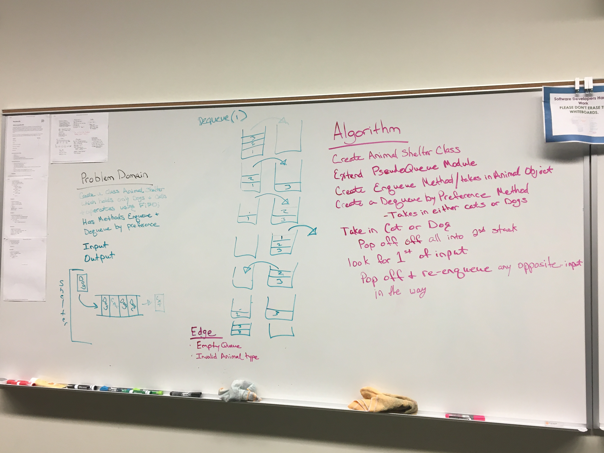

# FIFO Animal Shelter

## Code Challenge #12

**Create a class called AnimalShelter which holds only dogs and cats. 
The shelter operates using a first-in, first-out approach.

**Implement the following methods:
- enqueue(animal): adds animal to the shelter. animal can be either a dog or a cat object.
- dequeue(pref): returns either a dog or a cat. If pref is not "dog" or "cat" then return null.

## Approach & Efficiency

Stack: 
  * O(1) - push, pop, peek, isEmpty
Queue: 
  * O(1) - enqueue, dequeue, peek, isEmpty

### Stack
* push(value) - adds to top of stack
* pop() - removes from top of stack
* peek() - returns value of top node
* isEmpty() - returns boolean based on whether stack is empty

### Queue
* enqueue(value) - adds to end of queue
* dequeue() - removes from front of queue
* peek() - returns value at front of queue
* isEmpty() - returns boolean based of whether queue is empty

### Links and Resources
* [SUBMISSION PR](https://github.com/LindsayPeltier-401-advanced-javascript/data-structures-and-algorithms-401/pull/23)
* [TRAVIS-CI]()

#### Documentation
Run live-server on /doc files for full code documentation
* [DOCUMENTATION](/Users/lpeltier/DevStation/devstation/401/data-structures-and-algorithms-401/docs/stacksAndQueues_fifoAnimalShelter_fifo-animal-shelter.js.html)

### Solutions

[CODE](./fifo-animal-shelter.js)

### Whiteboard

