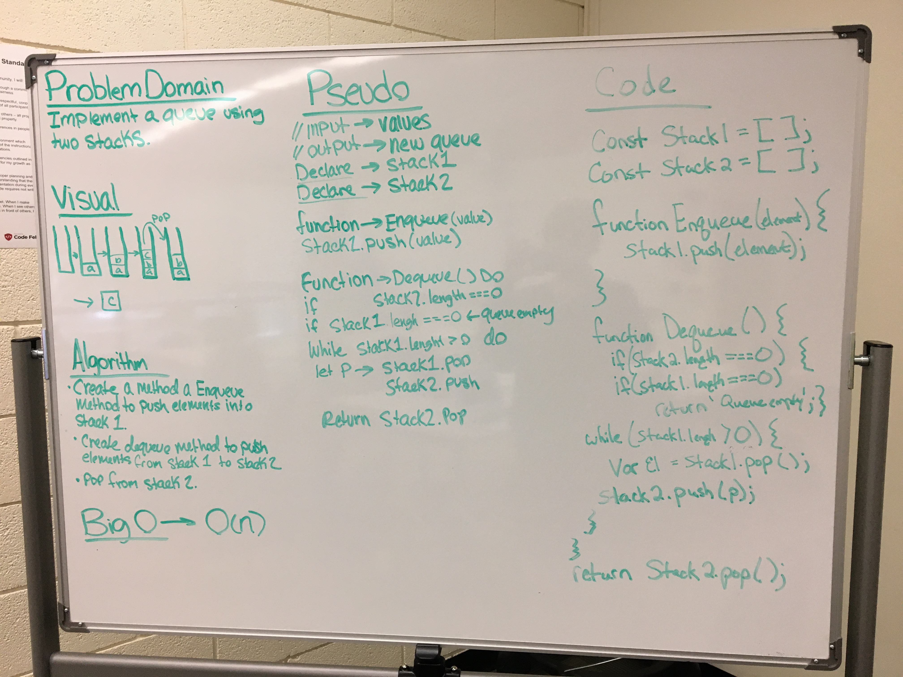

# Queue with Two Stacks

## Code Challenge #11

**Create a brand new PseudoQueue class.
- This PseudoQueue class will implement our standard queue interface (the two methods listed below), but will internally only utilize 2 Stack objects. 

**Create for this class, the following methods:
- enqueue(value) which inserts value into the PseudoQueue, using a first-in, first-out approach.
- dequeue() which extracts a value from the PseudoQueue, using a first-in, first-out approach.

**Instantiate Stack objects in your PseudoQueue constructor.

## Approach & Efficiency

Stack: 
  * O(1) - push, pop, peek, isEmpty
Queue: 
  * O(1) - enqueue, dequeue, peek, isEmpty

### Stack
* push(value) - adds to top of stack
* pop() - removes from top of stack
* peek() - returns value of top node
* isEmpty() - returns boolean based on whether stack is empty

### Queue
* enqueue(value) - adds to end of queue
* dequeue() - removes from front of queue
* peek() - returns value at front of queue
* isEmpty() - returns boolean based of whether queue is empty

### Links and Resources
* [SUBMISSION PR](https://github.com/LindsayPeltier-401-advanced-javascript/data-structures-and-algorithms-401/pull/22)
* [TRAVIS-CI](https://www.travis-ci.com/LindsayPeltier-401-advanced-javascript/data-structures-and-algorithms-401/builds/146864569)

#### Documentation
Run live-server on /doc files for full code documentation
* [DOCUMENTATION](/Users/lpeltier/DevStation/devstation/401/data-structures-and-algorithms-401/docs/stacksAndQueues_queueWithStacks_queue-with-stacks.js.html)

### Solutions

[CODE](./queue-with-stacks.js)

### Whiteboard

