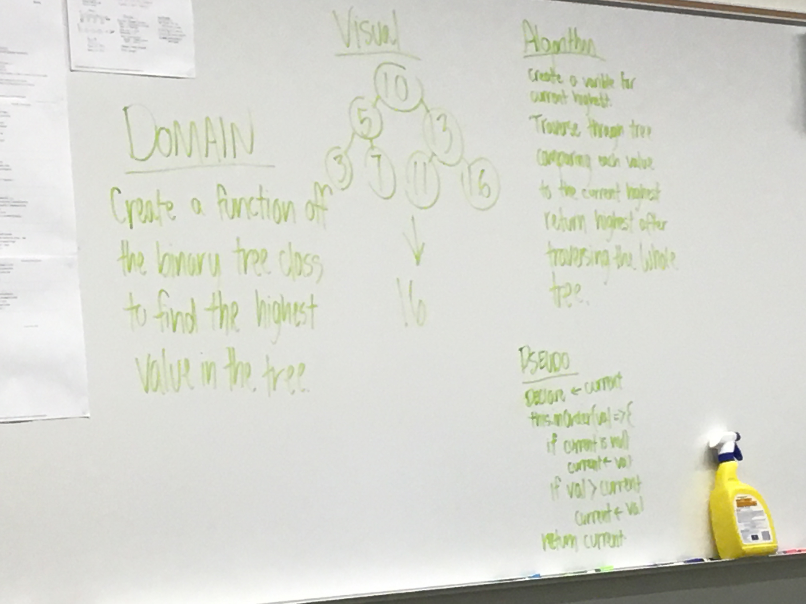

# Trees
Binary Tree and Binary Search Tree Implementation

## Challenge - Code Challenge #15
 - Create a Node class that has properties for the value stored in the node, the left child node, and the right child node.
 - Create a BinaryTree class
 - Define a method for each of the depth first traversals called preOrder, inOrder, and postOrder which returns an array of the values, ordered appropriately.

 - Create a BinarySearchTree class
 - Define a method named add that accepts a value, and adds a new node with that value in the correct location in the binary search tree.
 - Define a method named contains that accepts a value, and returns a boolean indicating whether or not the value is in the tree at least once.

## Approach & Efficiency
The Big O time complexity for inserting a new node is O(n). Searching for a specific node will also be O(n). Because of the lack of organizational structure in a Binary Tree, the worst case for most operations will involve traversing the entire tree. If we assume that a tree has n nodes, then in the worst case we will have to look at n items, hence the O(n) complexity. 

The Big O time complexity of a Binary Search Tree’s insertion and search operations is O(h), or O(height). 

The Big O space complexity of a BST search would be O(1). 
[Source](https://codefellows.github.io/common_curriculum/data_structures_and_algorithms/Code_401/class-15/resources/Trees.html)

## API
  - preOrder(callback) : Traverse the tree using the callback before going to the next node
  - postOrder(callback) : Traverse the tree using the callback after traversing the tree
  - inOrder(callback) : Traverse the tree using the callback between left and right child traversal
  - add(value) : adds a value to the correct position in the tree
  - contains(value) : searches the tree for a specific value and returns a boolean value

## Solution and Links

[Code](./tree.js)  
[Travis-CI](https://www.travis-ci.com/LindsayPeltier-401-advanced-javascript/data-structures-and-algorithms-401)  
[PR](https://github.com/LindsayPeltier-401-advanced-javascript/data-structures-and-algorithms-401/pull/13)

***

# Trees
Conduct “FizzBuzz” on a tree while traversing through it. Change the values of each of the nodes dependent on the current node’s value

## Challenge - Code Challenge #16
 - Write a function called FizzBuzzTree which takes a tree as an argument.
 - Without utilizing any of the built-in methods available to your language, determine whether or not the value of each node is divisible by 3, 5 or both. Create a new tree with the same structure as the original, but the values modified as follows:
 - If the value is divisible by 3, replace the value with “Fizz”
 - If the value is divisible by 5, replace the value with “Buzz”
 - If the value is divisible by 3 and 5, replace the value with “FizzBuzz”
 - If the value is not divisible by 3 or 5, simply turn the number into a String.
 - Return the new tree.

## Approach & Efficiency
The Big O time complexity for inserting a new node is O(n). Searching for a specific node will also be O(n). Because of the lack of organizational structure in a Binary Tree, the worst case for most operations will involve traversing the entire tree. If we assume that a tree has n nodes, then in the worst case we will have to look at n items, hence the O(n) complexity. 

The Big O time complexity of a Binary Search Tree’s insertion and search operations is O(h), or O(height). 

The Big O space complexity of a BST search would be O(1). 

## API
  - FizzBuzz Function evaluates a tree node value to remainder using an else/if loop
  - FizzBuzzTree uses recursion to move through tree nodes, applying FizzBuzz

## Solution and Links

[Code](./fizz-buzz-tree.js)  
[Travis-CI](https://www.travis-ci.com/LindsayPeltier-401-advanced-javascript/data-structures-and-algorithms-401)  
[PR](https://github.com/LindsayPeltier-401-advanced-javascript/data-structures-and-algorithms-401/pull/15)  

***

# Challenge Summary - Code Challenge #17
Breadth First Traversal of a Binary Tree

## Challenge Description
Write a breadth first traversal method which takes a Binary Tree as its unique input. 
Traverse the input tree using a Breadth-first approach, and return a list of the values in the tree in the order they were encountered.

## Approach & Efficiency
I start at the root node, and move down the tree, from left to right, one layer at a time. 
An empty queue is created, and the first node (the root node) is the first element enqueued. Additional nodes are enqueued while traversind across and down the tree. 

Time is 0(n), dependant on how many nodes are present. 

## Solution
[Code](./breadth-first.js)  
[Travis-CI](https://www.travis-ci.com/LindsayPeltier-401-advanced-javascript/data-structures-and-algorithms-401)  
[PR](https://github.com/LindsayPeltier-401-advanced-javascript/data-structures-and-algorithms-401/pull/18)  

***

# Challenge Summary - Code Challenge #18
Max Value of a Binary Search Tree

## Challenge Description
Write an instance method called find-maximum-value. Without utilizing any of the built-in methods available to your language, return the maximum value stored in the tree. You can assume that the values stored in the Binary Tree will be numeric.

## Approach & Efficiency
I can find the maximum node value by traversing right pointers until I reach the rightmost node, using a Binary Search Tree.

## Solution
[Code](./maxValue.js)  
[Travis-CI](https://www.travis-ci.com/LindsayPeltier-401-advanced-javascript/data-structures-and-algorithms-401)  
[PR](https://github.com/LindsayPeltier-401-advanced-javascript/data-structures-and-algorithms-401/pull/)  

