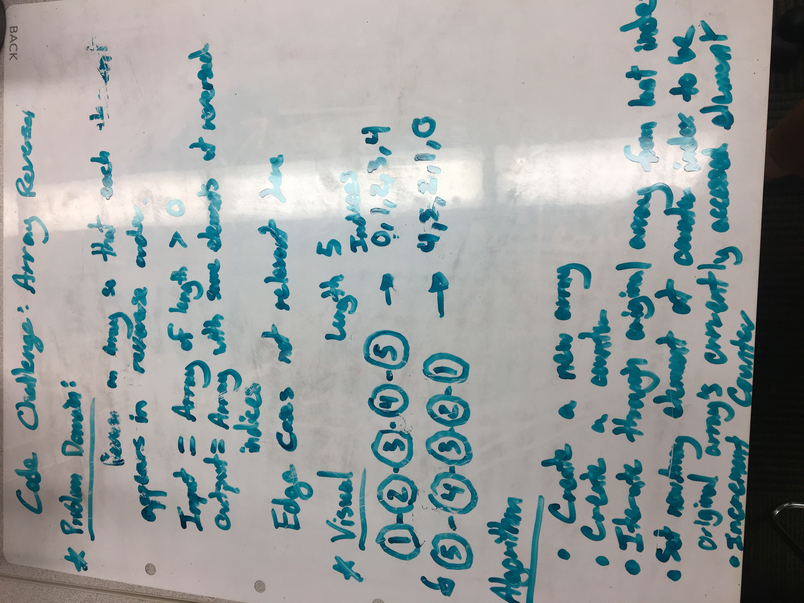
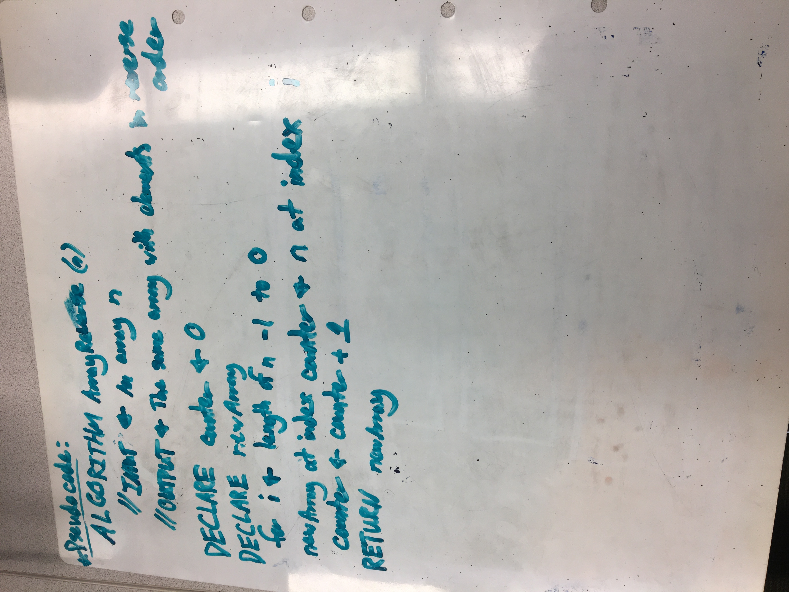

# Reverse an Array

## Challenge Description

Write a function called reverseArray which takes an array as an argument. Without utilizing any of the javascript built-in array methods, return an array with elements in reversed order.

## Approach & Efficiency

Our solution identifies the last element of the array using a for loop that iterates through the length of the array. Each element is moved to a new array in reverse order, so that the last element of the original array becomes the first element of the new array.

## Solution

## Submission Link
[Pull Request]()