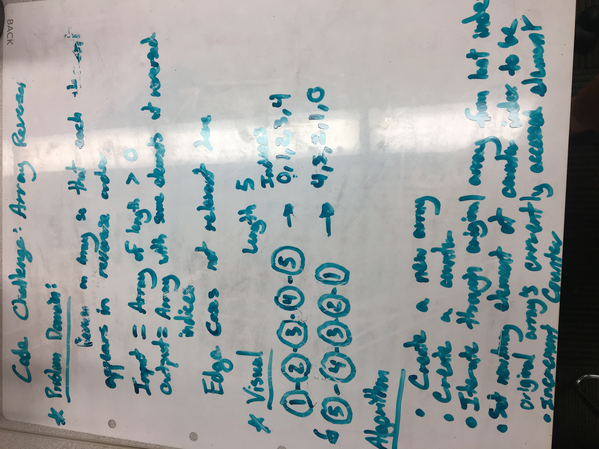

# Reverse an Array

Code Challenge to reverse an array without using inherent javascript array properties or methods

# Shift an Array

Code Challenge to insert a value into the middle of an array without using inherent javascript array properties or methods

Partner: Connor

## Challenge Description

Write a function called reverseArray which takes an array as an argument. Without utilizing any of the javascript built-in array methods, return an array with elements in reversed order.

## Approach & Efficiency

Our solution identifies the last element of the array using a for loop that iterates through the length of the array. Each element is moved to a new array in reverse order, so that the last element of the original array becomes the first element of the new array.

## Solution

[Code](./ArrayReverse.js)

---

Write a function called insertShiftArray which takes in an array and the value to be added. Without utilizing any of the built-in methods available to your language, return an array with the new value added at the middle index.

## Approach & Efficiency

Our solution identifies the midpoint by dividing the length of the array by 2, adding 0.5 to the midpoint number for arrays with an odd number length. We then iterate through the array, by length, until we reach the midpoint value, where the value parameter is inserted.

## Solution

[Code](./ArrayShift.js)

---

