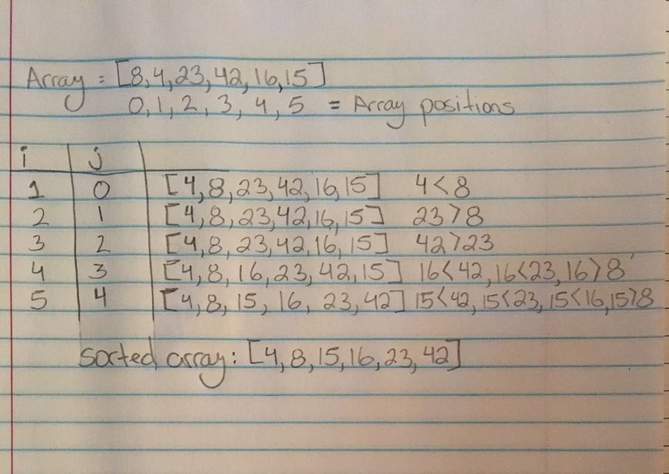

# Insertion Sort

Insertion sort is based on the idea that one element from the input elements is compared to preceding elements in each iteration to find its correct position.

It iterates the input elements by growing the sorted array at each iteration. It compares the current element with the largest value in the sorted array. If the current element is greater, then it leaves the element in its place and moves on to the next element else it finds its correct position in the sorted array and moves it to that position. This is done by shifting all the elements, which are larger than the current element, in the sorted array to one position ahead

## Psuedocode

```
  InsertionSort(int[] arr)
  
    FOR i = 1 to arr.length
    
      int j <-- i - 1
      int temp <-- arr[i]
      
      WHILE j >= 0 AND temp < arr[j]
        arr[j + 1] <-- arr[j]
        j <-- j - 1
        
      arr[j + 1] <-- temp
```
## Visual


## Trace
In our example array (which happens to be the number sequence from the TV show Lost): [8,4,23,42,16,15]

We start with by initializing the for loop at position 1, with i = 1 and j= i-1, and compares i to j, or 4 to 8. 4 is less than 8 and moves to the left, shifting all other numbers to the right. 
- i = 2 and j = 1 compares 23 to 8, with 23 > 8; the array stays the same.
- i = 3 and j = 2 compares 42 to 23, with 42 > 23, the array stays the same.
- i = 4 and j = 3 compares 16 to 42, with 16 < 42, and 16 < 23, and 16 > 8. 16 moves to the 2 position, shifting all other numbers to the right.
- i = 5 and j = 4 compares 15 to 42, with 15 < 42, and 15 < 23, and 15 < 16, and 15 > 8. 15 moves between 8 and 16, into the 2nd position, and all other numbers shift to the right. 

The loop concludes because the array length is 5, and the sorted array returns at [4,8,15,16,23,42] 

## Efficency 
The insertion sort requires comparison of each element to at least the preceding element, but in the worst case scenario, the element is compared with all the other elements in the sorted array. Therefore, for every element (N), there will be N(2) comparisons. 

The time complexity is O(N)2

